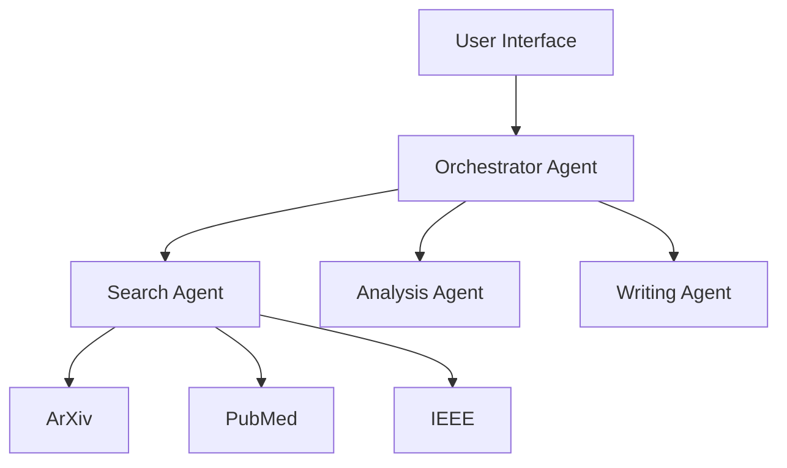

# **ARAS** (Assistant for Scientific Article Writing)  

  
  
  

ARAS is an advanced platform designed to assist with scientific research and article writing. Built on the **RAG (Retrieval-Augmented Generation)** architecture, ARAS leverages intelligent agents to automate the search, analysis, and synthesis of academic literature from multiple reputable sources.  


## 🚀 **Features**  

### 🔍 **Multi-Source Search**  
- Integration with **ArXiv**, **PubMed**, and **IEEE Xplore**  
- Asynchronous and parallel search  
- Automatic filtering and deduplication of results  

### 🧠 **Intelligent Analysis**  
- Automatic summary generation  
- Key point and methodology extraction  
- Identification of academic trends  

### ✍️ **Writing Assistance**  
- Literature review generation  
- Article structure suggestions  
- Citation management and academic style adaptation  

---

## 📋 **Prerequisites**  
- **Python 3.9** or later  
- Valid API keys for:  
  - **GroqCloud**  
  - **PubMed**  
  - **IEEE Xplore**  
- At least **8 GB of available RAM**  

---

## ⚙️ **Installation**  

1. Clone the repository:  
   ```bash  
   git clone https://github.com/your-username/aras.git  
   cd aras  
   ```  

2. Create a virtual environment:  
   ```bash  
   python -m venv venv  
   source venv/bin/activate  # For Windows: .\venv\Scripts\activate  
   ```  

3. Install dependencies:  
   ```bash  
   pip install -r requirements.txt  
   ```  

4. Configure environment variables:  
   ```bash  
   # Create a .env file at the root of the project  
   GROQ_API_KEY=your_groq_key  
   PUBMED_API_KEY=your_pubmed_key  
   IEEE_API_KEY=your_ieee_key  
   ```  

---

## 🎯 **Usage**  

### Basic Example  

```python  
from aras import ARAS  
from models import SearchQuery  
import asyncio  

async def main():  
    aras = ARAS()  
    query = SearchQuery(  
        query="transformer architecture deep learning",  
        filters={"year": "2023-2024"},  
        limit_per_source=3  
    )  
    result = await aras.process_query(query)  
    print(result)  

if __name__ == "__main__":  
    asyncio.run(main())  
```  

---

## 🔧 **Architecture**  

ARAS is built on a modular architecture that incorporates:  
- **LangChain**: For managing LLMs and prompt interactions  
- **LangGraph**: For agent orchestration  
- **Pydantic**: For data validation  
- **AsyncIO**: For handling asynchronous operations  



---

## 📊 **Performance**  
- **Average response time**: < 10 seconds  
- **Processing capacity**: Up to 1,000 articles in parallel  
- **Multilingual support**: Handles multiple languages for analysis  

---

## 🛠 **Development**  

### Project Structure  

```
aras/  
├── config.py          # Configuration  
├── models.py          # Data models  
├── agents/            # AI agents  
│   ├── research.py  
│   ├── analyzer.py  
│   └── writer.py  
├── sources/           # Data source connectors  
│   ├── arxiv.py  
│   ├── pubmed.py  
│   └── ieee.py  
└── graph/             # Workflow management  
    ├── nodes.py  
    └── workflow.py  
```  

### Testing  

```bash  
# Install testing dependencies  
pip install pytest pytest-asyncio  

# Run tests  
pytest tests/  
```  


## 📄 **License**  
This project is licensed under the **MIT License**. See the [LICENSE](LICENSE) file for details.  


## 👥 **Author**  
- [Sanogo Kassoum](https://github.com/kassoumsanogo1)  

For questions or suggestions:  
- **Email**: kassoum.sanogo@outlook.com  

### 📌 **Cite ARAS**  
If you use ARAS in your work, please cite it as follows:  

```bibtex  
@software{aras2025,  
  author = Sanogo Kassoum,
  mail = kassoum.sanogo@outlook.com,
  title = {ARAS: Assistant for Scientific Article Writing},  
  year = {2025},  
  publisher = {GitHub},  
  url = {https://github.com/your-username/aras](https://github.com/kassoumsanogo1/Scientific-Paper-Research-Assistant.git}  
}  
```  
